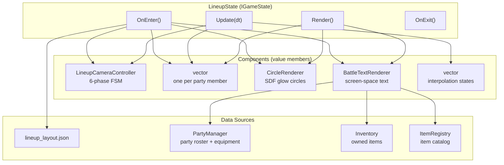
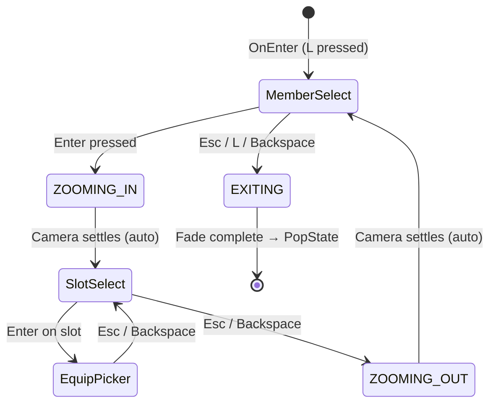

# Chapter 13 — Party Lineup & Equipment System

> Cinematic character showcase with a zero-UI-chrome philosophy.
> "Characters ARE the art — no dialog boxes, no panels, no overlays."

---

## Table of Contents

1. [Overview](#1-overview)
2. [File Inventory](#2-file-inventory)
3. [Architecture Diagram](#3-architecture-diagram)
4. [State Machine Design](#4-state-machine-design)
5. [Camera System — LineupCameraController](#5-camera-system--lineupcameracontroller)
6. [Per-Character Animation — CharacterSlotAnim](#6-per-character-animation--characterslotanim)
7. [Rendering Pipeline — The 3-Pass Architecture](#7-rendering-pipeline--the-3-pass-architecture)
8. [Coordinate System Bridge — WorldToScreen()](#8-coordinate-system-bridge--worldtoscreen)
9. [Layout System — Ratio-Based Positioning](#9-layout-system--ratio-based-positioning)
10. [Input FSM](#10-input-fsm)
11. [Equipment System Integration](#11-equipment-system-integration)
12. [Data Configuration — lineup_layout.json](#12-data-configuration--lineup_layoutjson)
13. [Font Configuration](#13-font-configuration)
14. [Lifecycle — OnEnter / OnExit](#14-lifecycle--onenter--onexit)
15. [Common Mistakes & Gotchas](#15-common-mistakes--gotchas)
16. [Tuning Guide](#16-tuning-guide)

---

## 1. Overview

The Party Lineup system is a full-screen cinematic overlay activated by pressing `L` during overworld gameplay. It serves two purposes:

1. **Lineup View** — A showcase of all party members standing side by side with a dramatic tilted camera (10° Dutch angle), atmospheric SDF glow effects, and smooth interpolated character selection.
2. **Character View** — A zoomed-in inspection of a single party member showing their equipment slots, full stat panel, and an equipment picker for swapping gear.

### Design Philosophy

| Principle | Implementation |
|-----------|---------------|
| Characters are the hero | Sprites are large and centered, no UI frames surrounding them |
| Zero UI chrome | No dialog boxes, borders, or 9-slice panels — text floats directly on the cinematic backdrop |
| Fully data-driven | All positions, scales, camera parameters, and font sizes loaded from `data/lineup_layout.json` |
| Resolution-independent | Character view uses ratio-based positioning (`screen_width × ratio`) — no hardcoded pixel values |
| Smooth everything | Every state change (camera, character selection, glow) uses exponential decay interpolation — never instant snaps |

### Entry / Exit

- **Hotkey**: Press `L` during overworld → `StateManager::PushState<LineupState>()`
- **Exit**: Press `Esc`, `L`, or `Backspace` from the lineup overview → camera zooms out + fades to black → deferred `PopState()`

---

## 2. File Inventory

```
src/States/
├── LineupState.h              — Class definition, enums, config structs
├── LineupState.cpp            — Lifecycle, input FSM, camera transitions
├── LineupStateRender.cpp      — 3-pass rendering (glow → sprites → text)
└── LineupCameraController.h   — 6-phase cinematic camera FSM

data/
└── lineup_layout.json         — All tunable config values (camera, layout, fonts)
```

### Why two `.cpp` files?

Rendering logic is ~450 lines of draw calls, font math, and positioning. Mixing it with the 550-line FSM/input logic would make the file unreadable. The split follows the same pattern as `BattleState.cpp` + `BattleRenderer.cpp`.

Build script note: both `LineupState.cpp` and `LineupStateRender.cpp` must be listed in `build_src_static.bat`.

---

## 3. Architecture Diagram



### Ownership Model

| Component | Lifetime | Ownership |
|-----------|----------|-----------|
| `LineupCameraController` | Value member | `LineupState` |
| `WorldSpriteRenderer[]` | `vector<unique_ptr>` | `LineupState` |
| `CircleRenderer` | Value member | `LineupState` |
| `BattleTextRenderer` | Value member | `LineupState` |
| `CharacterSlotAnim[]` | `vector` | `LineupState` |

All components are created in `OnEnter()` and destroyed in `OnExit()`. No heap allocations escape the state.

---

## 4. State Machine Design

LineupState operates on two orthogonal axes:

### View (which screen is shown)

```
View::Lineup     ←→    View::Character
```

### Phase (what input does)

```
Phase::MemberSelect  →  Phase::SlotSelect  →  Phase::EquipPicker
       (lineup)              (character)           (character)
```

### Combined FSM Diagram



### Phase Gate Pattern

Camera transitions are **blocking** — input is disabled during `ENTERING`, `ZOOMING_IN`, `ZOOMING_OUT`, and `EXITING`. When the camera reaches its target (checked via epsilon comparison), the auto-transition fires:

```cpp
// ZOOMING_IN → FOCUSED when zoom settles
if (mCameraCtrl.GetPhase() == LineupCameraPhase::ZOOMING_IN &&
    mCameraCtrl.IsFocusSettled())
{
    mView  = View::Character;
    mPhase = Phase::SlotSelect;
    mCameraCtrl.SetPhase(LineupCameraPhase::FOCUSED);
}
```

### Deferred Exit Pattern

`PopState()` is NEVER called mid-frame. The pattern:

1. `EXITING` camera phase completes → set `mPendingSafeExit = true`
2. At the END of `Update()`, check the flag → call `PopState()`
3. This prevents mid-frame destruction of the state while renderers still hold references

This is the same pattern used by `BattleState` (iris transition → deferred exit).

---

## 5. Camera System — LineupCameraController

### Overview

`LineupCameraController` manages smooth camera transitions using exponential decay interpolation (same formula as `BattleCameraController`):

```
current += (desired - current) × smoothSpeed × dt
```

This produces frame-rate-independent, self-correcting motion with no overshoot.

### Six Phases

| Phase | Zoom | Rotation | Alpha | Purpose |
|-------|------|----------|-------|---------|
| `ENTERING` | 0.5 → 1.0 | 0° → 10° | 0.0 → 1.0 | Cinematic entrance (zoom in + fade from black) |
| `IDLE` | 1.0 | 10° | 1.0 | Stable overview — input enabled |
| `ZOOMING_IN` | 1.0 → 1.8 | 10° → 5° | 1.0 | Dolly toward selected character |
| `FOCUSED` | 1.8 → 1.0 | 5° → 0° | 1.0 | Character view — camera settles at identity for UI alignment |
| `ZOOMING_OUT` | back → 1.0 | back → 10° | 1.0 | Dolly back to overview |
| `EXITING` | 1.0 → 0.5 | 10° → 0° | 1.0 → 0.0 | Cinematic exit (zoom out + fade to black) |

### Why FOCUSED Settles at Zoom=1.0 / Rotation=0°

The character view uses screen-space UI elements (text, stat panels) alongside world-space sprites (character through camera). At `zoom=1.0` and `rotation=0.0`, camera coordinates map 1:1 to screen pixels. This eliminates the coordinate drift between screen-space glow and world-space sprites.

The `ZOOMING_IN → FOCUSED` transition creates a dramatic "reveal" effect: the camera overshoots to 1.8× zoom, then settles back to 1.0× as the character view appears.

### Config Structure

```cpp
struct LineupCameraConfig
{
    float enterZoom, enterRotation;         // start of ENTERING
    float idleZoom, idleRotation;           // IDLE target
    float characterZoom, characterRotation; // ZOOMING_IN overshoot target
    float focusedZoom, focusedRotation;     // FOCUSED settled state
    float exitZoom, exitRotation;           // EXITING target
    float smoothSpeed;                      // lerp coefficient
    float fadeSpeed;                        // fade alpha coefficient
};
```

All values loaded from JSON. Rotation is stored in degrees in JSON, converted to radians at load time via `× π/180`.

---

## 6. Per-Character Animation — CharacterSlotAnim

Each party member has a `CharacterSlotAnim` struct that independently interpolates three properties:

| Property | Selected Value | Normal Value | Description |
|----------|---------------|-------------|-------------|
| `currentScale` | 3.2× | 2.2× | Sprite scale (selected character is bigger) |
| `currentGlowAlpha` | 1.0 | 0.0 | SDF glow intensity (glow only on selected) |
| `currentOffsetY` | -15px | 0px | Vertical offset (selected character rises) |

### How Cursor Changes Work

```
User presses Right arrow
  → HandleMemberSelectInput() detects edge
  → OnCursorChanged(oldCursor=0, newCursor=1)
    → mSlotAnims[0].SetNormal(2.2)     ← old: scale down, glow off, drop back
    → mSlotAnims[1].SetSelected(3.2, -15)  ← new: scale up, glow on, rise up
  → Each frame, Update() → anim.Update(dt, lerpSpeed)
    → currentScale += (targetScale - currentScale) × 6.0 × dt
    → smooth transition over ~0.3 seconds
```

The renderer reads `currentScale` / `currentGlowAlpha` / `currentOffsetY` and never sees the target values. This guarantees all visual transitions are smooth.

### Initialization

On `OnEnter()`, the first character (cursor=0) is seeded with selected values **both target AND current**, so it appears at full scale from frame 1. Other characters start at normal scale.

---

## 7. Rendering Pipeline — The 3-Pass Architecture

Rendering is split into three strict passes that must not be interleaved:

```
┌─────────────────────────────────────────────────────┐
│  PASS 1: CircleRenderer (SDF glow circles)          │
│    - Screen-space coordinates                       │
│    - Writes to color buffer only (depth OFF)        │
│    - Atmospheric glow behind characters             │
├─────────────────────────────────────────────────────┤
│  PASS 2: WorldSpriteRenderer (character sprites)    │
│    - World-space coordinates through camera          │
│    - SpriteBatch with camera.GetViewMatrix()        │
│    - Depth OFF (2D layer order model)               │
├─────────────────────────────────────────────────────┤
│  PASS 3: BattleTextRenderer (all text)              │
│    - Screen-space coordinates                       │
│    - SpriteFont with transform matrices             │
│    - Names, stats, equipment labels, hints          │
└─────────────────────────────────────────────────────┘
```

### Why This Order?

1. **Glow first** — drawn behind characters as atmospheric background
2. **Sprites second** — drawn on top of glow, below text
3. **Text last** — always on top, always readable

### Why No Interleaving?

Each renderer uses a different D3D pipeline state (blend mode, depth state, sampler). Interleaving would cause state thrashing on the GPU and can produce incorrect depth test results (CircleRenderer's SDF shader fills the depth buffer, which would occlude sprites if drawn after).

---

## 8. Coordinate System Bridge — WorldToScreen()

> **This is the most critical architectural decision in the rendering pipeline.**

### The Problem

Two renderers use different coordinate systems:

| Renderer | Coordinate System | Input |
|----------|-------------------|-------|
| `CircleRenderer` (glow) | Screen pixels (0,0 = top-left) | Direct pixel coords |
| `WorldSpriteRenderer` (sprites) | World units, transformed by camera | Camera-relative world coords |

When the camera has zoom ≠ 1.0 or rotation ≠ 0°, a world position `(100, 200)` does NOT map to screen pixel `(100, 200)`. The glow and sprite would drift apart.

### The Solution

Both glow and sprite derive from **ONE shared world position**. The glow position is computed by projecting the sprite's world position through the camera via `Camera2D::WorldToScreen()`:

```cpp
// ONE world position — the sprite's feet
const float sprWorldX = spriteX - fW * 0.5f;
const float sprWorldY = spriteY - fH * 0.5f;

// Project through camera to get ACTUAL screen position
DirectX::XMFLOAT2 sprScreen = cam.WorldToScreen(sprWorldX, sprWorldY);

// PASS 1: Glow uses the computed screen position
mGlow.Draw(ctx, sprScreen.x, sprScreen.y + glowOffsetY, ...);

// PASS 2: Sprite uses the original world position
mSprites[i]->Draw(ctx, cam, sprWorldX, sprWorldY, scale, false);
```

### Why This Works

`WorldToScreen()` applies the full camera transform (translate → rotate → zoom → center) and converts the result from NDC to pixel space. The glow circle is placed at the exact screen pixel where the sprite's pivot lands. They can never drift.

### WorldToScreen Implementation

```cpp
XMFLOAT2 WorldToScreen(float worldX, float worldY) const
{
    XMVECTOR pos  = XMVectorSet(worldX, worldY, 0.0f, 1.0f);
    XMVECTOR clip = XMVector4Transform(pos, mViewProj);

    float w = XMVectorGetW(clip);
    if (w == 0.0f) w = 1.0f;
    float ndcX = XMVectorGetX(clip) / w;
    float ndcY = XMVectorGetY(clip) / w;

    return {
        ( ndcX + 1.0f) * 0.5f * (float)mScreenW,
        (-ndcY + 1.0f) * 0.5f * (float)mScreenH
    };
}
```

---

## 9. Layout System — Ratio-Based Positioning

### Lineup View Layout

Characters are evenly spaced horizontally, centered on screen:

```
totalWidth  = (partySize - 1) × characterSpacing
baseX       = (screenWidth - totalWidth) / 2
character_i = baseX + i × characterSpacing
floorY      = screenHeight × floorRatio  (default 0.68)
```

All values from JSON — spacing, floor ratio, scales.

### Character View Layout — 3-Column Design

```
┌─────────────────────────────────────────────────┐
│              CHARACTER NAME (centered)           │
│              Lv.XX                               │
│                                                  │
│  EQUIPMENT  │       ████████████    │   STATS     │
│  > Weapon   │       ██LARGE    ██  │   HP  100   │
│    Body     │       ██CHARACTER██  │   MP   50   │
│    Head     │       ██         ██  │   ATK  10   │
│    Accessory│       ██ [GLOW]  ██  │   DEF   4   │
│             │       ████████████    │   MATK 25   │
│             │                      │   MDEF 10   │
│             │                      │   SPD   5   │
│                                                  │
│  Up/Down: Slot  Left/Right: Char  Enter  Esc     │
└─────────────────────────────────────────────────┘
     LEFT              CENTER            RIGHT
   (4-35%)           (35-70%)          (72-95%)
```

All positions use **screen ratios**, not pixel values:

```cpp
const float spriteX = fW * mCharLayout.spriteXRatio;  // 0.52 = 52% of width
const float spriteY = fH * mCharLayout.spriteYRatio;  // 0.72 = 72% of height
const float slotX   = fW * mCharLayout.slotListXRatio; // 0.04 = 4% of width
const float statX   = fW * mCharLayout.statXRatio;     // 0.72 = 72% of width
```

This means resizing the window naturally repositions everything.

---

## 10. Input FSM

### Edge Detection Pattern

All input uses edge detection (press, not hold) via a lambda that tracks `wasDown` state:

```cpp
auto pressed = [](int vk, bool& wasDown) -> bool {
    const bool down  = (GetAsyncKeyState(vk) & 0x8000) != 0;
    const bool fresh = down && !wasDown;
    wasDown = down;
    return fresh;
};
```

### Key Bindings

| View/Phase | Key | Action |
|-----------|-----|--------|
| **Lineup → MemberSelect** | Left/Right | Cycle party members |
| | Enter | Zoom into selected character |
| | Esc / L / Backspace | Exit lineup screen |
| **Character → SlotSelect** | Up/Down | Cycle equipment slots (4 slots) |
| | Left/Right | Switch to adjacent party member |
| | Enter | Open equipment picker for selected slot |
| | Esc / Backspace | Zoom back to lineup overview |
| **Character → EquipPicker** | Up/Down | Scroll through available items |
| | Enter | Equip selected item (or unequip) |
| | Esc / Backspace | Close picker, return to slot select |

### Input Blocking During Transitions

Input is completely blocked during camera transitions:

```cpp
const bool inputBlocked = (camPhase == ENTERING  ||
                           camPhase == ZOOMING_IN ||
                           camPhase == ZOOMING_OUT ||
                           camPhase == EXITING);
```

During blocked phases, key edge states are still consumed to prevent phantom inputs when the transition completes.

### Stale Edge Prevention

On `OnEnter()`, all `wasDown` flags are set to `true`:

```cpp
mEscWasDown   = true;
mLWasDown     = true;
// ... all others
```

This prevents the `L` key that opened the lineup from immediately registering as a press and closing it.

---

## 11. Equipment System Integration

### Equipment Slots

Four equipment slots per character, in order:

```cpp
enum class EquipSlot { None, Weapon, Body, Head, Accessory };
constexpr int kEquipSlotCount = 4;
```

### Data Flow

```
User opens picker:
  → RefreshPicker()
  → Filters Inventory::OwnedIds() by EquipSlot match
  → Populates mPickerItems (vector<string> of item IDs)
  → Appends "(unequip)" option at the end

User selects an item:
  → PartyManager::EquipItem(memberIdx, slot, itemId)
  → PartyManager recalculates effective stats (base + equipment bonuses)
  → Flash message: "Equipped Iron Sword"

User selects "(unequip)":
  → PartyManager::UnequipItem(memberIdx, slot)
  → Flash message: "Unequipped Iron Sword"
```

### Stat Preview

When hovering over an item in the picker, the stats panel shows a live preview:

```cpp
previewStats = PartyManager::Get().PreviewEffectiveStats(
    mMemberCursor, mPickerSlot, mPickerItems[mPickerCursor]);
```

Green `+N` / red `-N` deltas are shown next to each stat that would change.

### Scroll Management

The picker has a configurable visible window (`pickerMaxVisible = 7`). Scrolling follows the cursor:

```cpp
if (mPickerCursor < mPickerScroll)
    mPickerScroll = mPickerCursor;
if (mPickerCursor >= mPickerScroll + maxVisible)
    mPickerScroll = mPickerCursor - maxVisible + 1;
```

---

## 12. Data Configuration — lineup_layout.json

Every tunable visual parameter lives in `data/lineup_layout.json`. The game never needs recompilation to adjust the layout.

### Camera Section

| Key | Default | Unit | Description |
|-----|---------|------|-------------|
| `camera_enterZoom` | 0.5 | mult | Starting zoom (zoomed out) |
| `camera_enterRotationDeg` | 0 | degrees | Starting rotation |
| `camera_idleZoom` | 1.0 | mult | Overview zoom level |
| `camera_idleRotationDeg` | 10 | degrees | Dutch angle tilt |
| `camera_characterZoom` | 1.8 | mult | Zoom-in overshoot target |
| `camera_characterRotationDeg` | 5 | degrees | Rotation during zoom-in |
| `camera_focusedZoom` | 1.0 | mult | Settled char view zoom (identity) |
| `camera_focusedRotationDeg` | 0 | degrees | Settled char view rotation |
| `camera_exitZoom` | 0.5 | mult | Exit zoom target |
| `camera_exitRotationDeg` | 0 | degrees | Exit rotation target |
| `camera_smoothSpeed` | 4.0 | 1/s | Exponential decay coefficient |
| `camera_fadeSpeed` | 3.5 | 1/s | Fade alpha interpolation speed |

### Lineup View Section

| Key | Default | Unit | Description |
|-----|---------|------|-------------|
| `lineup_characterSpacing` | 280 | px | Horizontal gap between characters |
| `lineup_normalScale` | 2.2 | mult | Sprite scale for non-selected characters |
| `lineup_selectedScale` | 3.2 | mult | Sprite scale for selected character |
| `lineup_selectedOffsetY` | -15 | px | Selected character rises this much |
| `lineup_floorRatio` | 0.68 | ratio | Floor line as a ratio of screen height |
| `lineup_glowRadius` | 130 | px | Base radius of glow circles |
| `lineup_slotLerpSpeed` | 6.0 | 1/s | How fast selection animations interpolate |
| `lineup_glowOffsetY` | -40 | px | Glow center offset from sprite feet |

### Character View Section (ratio-based)

| Key | Default | Unit | Description |
|-----|---------|------|-------------|
| `char_spriteXRatio` | 0.52 | ratio | Character horizontal position (0.5 = center) |
| `char_spriteYRatio` | 0.72 | ratio | Character feet vertical position |
| `char_spriteScale` | 4.5 | mult | Character sprite scale |
| `char_glowOffsetY` | -100 | px | Glow offset from feet (body center) |
| `char_glowRadius` | 180 | px | Glow circle radius |
| `char_nameYRatio` | 0.06 | ratio | Name text vertical position |
| `char_slotListXRatio` | 0.04 | ratio | Equipment panel left edge |
| `char_slotListYRatio` | 0.18 | ratio | Equipment panel top edge |
| `char_slotSpacing` | 70 | px | Vertical gap between equipment slots |
| `char_statXRatio` | 0.72 | ratio | Stats panel left edge |
| `char_statYRatio` | 0.18 | ratio | Stats panel top edge |
| `char_pickerXRatio` | 0.04 | ratio | Equipment picker left edge |
| `char_pickerYRatio` | 0.18 | ratio | Equipment picker top edge |
| `char_pickerItemHeight` | 52 | px | Vertical gap between picker items |
| `char_pickerMaxVisible` | 7 | count | Max visible items before scrolling |

### Font Section

| Key | Default | Description |
|-----|---------|-------------|
| `font_titleScale` | 1.2 | "Team" title text |
| `font_sectionScale` | 0.75 | Section headers: EQUIPMENT, STATS |
| `font_nameScale` | 0.9 | Character name |
| `font_bodyScale` | 0.7 | Equipment items, stat labels, stat values |
| `font_smallScale` | 0.55 | Level, hint footer, bonus text |

---

## 13. Font Configuration

Fonts use 5 semantic categories, not raw sizes. This ensures consistent hierarchy:

```
TITLE (1.2×)       ← "Team" header, only in lineup view
  ├── NAME (0.9×)     ← Character names ("Verso")
  ├── SECTION (0.75×) ← Section labels ("EQUIPMENT", "STATS")
  ├── BODY (0.7×)     ← Data text (slot labels, item names, stat rows)
  └── SMALL (0.55×)   ← Minor info (Lv.XX, hint footer, stat bonuses)
```

Font rendering uses `BattleTextRenderer` with `DirectX::XMMatrixScaling(scale, scale, 1.0f)` as the transform matrix. The base font is `assets/fonts/arial_16.spritefont` — scales multiply from this base size.

---

## 14. Lifecycle — OnEnter / OnExit

### OnEnter()

1. `ItemRegistry::Get().EnsureLoaded()` — force-load item catalog
2. `LoadLayoutConfig()` — read `lineup_layout.json` into config structs
3. Initialize renderers:
   - `CircleRenderer::Initialize(device)` — SDF shader setup
   - `BattleTextRenderer::Initialize(device, context, font_path, W, H)`
4. `LineupCameraController::Initialize(W, H, config)` — starts in `ENTERING`
5. Load one `WorldSpriteRenderer` per party member:
   - Load `SpriteSheet` from each member's `animJsonPath`
   - Upload texture via `WICTextureLoader`
   - Play `"idle"` animation clip
6. Initialize `CharacterSlotAnim` array — cursor=0 starts at selected scale
7. Reset all state: view, phase, cursors, flash message, elapsed timer
8. Set all `wasDown` edge trackers to `true` (absorb opening keypress)

### OnExit()

1. `Shutdown()` each `WorldSpriteRenderer` (release GPU SRV, SpriteBatch, blend/depth states)
2. Clear sprite and slot anim vectors
3. `Shutdown()` text renderer and circle renderer
4. No deferred cleanup needed — all resources are deterministically released

---

## 15. Common Mistakes & Gotchas

### 1. Glow/sprite drift under camera transforms

**Symptom**: Glow circle appears in the wrong position when camera has rotation or zoom.

**Root cause**: Glow uses screen-space coords, sprite uses world-space coords transformed by camera. At camera zoom ≠ 1.0 or rotation ≠ 0°, these diverge.

**Fix**: Always derive glow position from `Camera2D::WorldToScreen(spriteWorldX, spriteWorldY)` — both renderers share ONE world position as the source of truth.

### 2. Hardcoded pixel positions

**Symptom**: Layout breaks at different window sizes.

**Root cause**: Using absolute pixel values like `spriteX = 780.0f` instead of ratios.

**Fix**: All character view positions use `screen_dimension × ratio`. Lineup view uses centered distribution from `characterSpacing`.

### 3. Input ghost on state enter

**Symptom**: Lineup immediately closes when opened because the `L` key is still held.

**Root cause**: `GetAsyncKeyState()` returns the current key state, not edge-detected. The key that opened the state is still physically down.

**Fix**: On `OnEnter()`, set all `wasDown` flags to `true`. The next frame, when the key is released, the edge detector correctly returns false. No phantom press.

### 4. PopState during render

**Symptom**: Crash or visual corruption when exiting.

**Root cause**: Calling `PopState()` mid-update destroys the state while renderers still hold references to its members.

**Fix**: Deferred exit pattern — set `mPendingSafeExit = true` during the phase gate check, call `PopState()` at the very end of `Update()`.

### 5. Forgetting Camera2D::Update() after SetPosition/SetZoom

**Symptom**: Camera appears frozen for one frame after a property change.

**Root cause**: Camera2D uses a dirty flag — matrices are only rebuilt in `Update()`. If `Update()` isn't called, `GetViewMatrix()` returns the old matrix.

**Fix**: `LineupCameraController::Update()` always calls `ApplyToCamera()` → `Camera2D::Update()`.

---

## 16. Tuning Guide

### Making the camera feel more/less dramatic

| Change | Increase | Decrease |
|--------|----------|----------|
| Dutch angle tilt | `camera_idleRotationDeg` up to 15° | Down to 5° |
| Entry drama | Lower `camera_enterZoom` (0.3) | Raise to 0.7 |
| Zoom-in overshoot | Raise `camera_characterZoom` (2.5) | Lower to 1.4 |
| Transition speed | Raise `camera_smoothSpeed` (6.0) | Lower to 2.0 |
| Fade speed | Raise `camera_fadeSpeed` (5.0) | Lower to 2.0 |

### Adjusting character size

| Context | JSON Key | Effect |
|---------|----------|--------|
| Lineup (normal) | `lineup_normalScale` | All non-selected chars |
| Lineup (selected) | `lineup_selectedScale` | Selected char only |
| Character view | `char_spriteScale` | Single zoomed character |

### Moving the glow

| View | JSON Key | Description |
|------|----------|-------------|
| Lineup | `lineup_glowOffsetY` | Vertical offset from sprite feet (-40 = slightly above feet) |
| Character | `char_glowOffsetY` | Same concept (-100 = body center) |
| Character | `char_glowRadius` | Glow circle size (180 = large aura) |

### Repositioning the 3-column layout

All character view positions are ratios of screen size (0.0 = left/top, 1.0 = right/bottom):

```json
{
  "char_spriteXRatio": 0.52,     // shift character left/right
  "char_spriteYRatio": 0.72,     // shift character up/down (feet position)
  "char_slotListXRatio": 0.04,   // equipment panel left edge
  "char_statXRatio": 0.72,       // stats panel left edge
  "char_nameYRatio": 0.06        // name text vertical position
}
```

### Adjusting text size hierarchy

All font scales multiply from the base 16px SpriteFont. The 5 semantic categories ensure consistent hierarchy — never set a specific px size, adjust the category:

```json
{
  "font_titleScale": 1.2,    // biggest  (19.2px effective)
  "font_nameScale": 0.9,     // large    (14.4px)
  "font_sectionScale": 0.75, // medium   (12.0px)
  "font_bodyScale": 0.7,     // normal   (11.2px)
  "font_smallScale": 0.55    // small    (8.8px)
}
```

---

> **All layout changes take effect by editing `data/lineup_layout.json` — no recompilation needed.**
