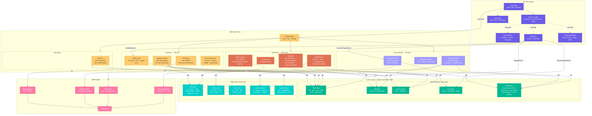

```mermaid


graph TD
    subgraph Core["🏗️ Core Engine"]
        direction TB
        GameApp["GameApp\nGame Loop · Window"]
        ServiceLocator["ServiceLocator\nĐăng ký / truy xuất mọi hệ thống"]
        InputManager["InputManager\nKeyboard · Mouse · Gamepad"]
        GameTimer["GameTimer\nDelta Time · Fixed Step"]
        EventBus["EventBus\nPublish / Subscribe"]
        ResourceManager["ResourceManager\nCache Texture · Audio · JSON"]

        GameApp --> ServiceLocator
        GameApp --> GameTimer
        ServiceLocator -.->|"cung cấp"| InputManager
        ServiceLocator -.->|"cung cấp"| EventBus
        ServiceLocator -.->|"cung cấp"| ResourceManager
    end

    subgraph DataLayer["💾 Data Layer — Nguồn sự thật duy nhất"]
        direction TB

        subgraph GameDatabase["GameDatabase (trung tâm)"]
            PlayerData["PlayerData\nHP · MP · Level · EXP\nGold · Equipment"]
            PartyData["PartyData\nvector&lt;CharacterData&gt;"]
            InventoryData["InventoryData\nItems · Quantities"]
            QuestData["QuestData\nActive · Completed · Flags"]
            WorldFlags["WorldFlags\nmap&lt;string, variant&gt;\nNPC states · Door locked\nBoss defeated · Story progress"]
        end

        subgraph StaticData["Static Data (JSON / file)"]
            SkillDB["skills.json\nID · Name · Type\nBaseDamage · Effects\nAnimation · Cost"]
            EnemyDB["enemies.json\nID · Name · Stats\nSkills · Drops · AI"]
            ItemDB["items.json\nID · Name · Type\nEffects · Price"]
            CutsceneDB["cutscenes.json\nID · Trigger · Dialogue\nConditions · Actions"]
            UpgradeDB["upgrades.json\nID · StatModifiers\nRequirements · Cost"]
        end
    end

    subgraph States["🎮 Game States"]
        direction TB
        StateManager["StateManager\nPush · Pop · Change"]

        subgraph WorldState["PlayState — Thế giới"]
            WorldLogic["World Logic\nDi chuyển · NPC · Trigger Zone"]
            UpgradeShop["Upgrade System\nĐọc UpgradeDB\nGhi vào PlayerData"]
            SkillEquip["Skill Equip\nĐọc SkillDB\nGhi vào CharacterData"]
            WorldECS["ECS Components\nPosition · Velocity\nCollider · Renderable"]
        end

        subgraph BattleState["BattleState — Chiến đấu"]
            BattleInit["Battle Init\nĐọc PartyData → PlayerCombatant\nĐọc EnemyDB → EnemyCombatant"]
            ActionQueue["ActionQueue\nCommand Pattern"]
            SkillExec["Skill Execution\nĐọc SkillDB\nÁp dụng CharacterData modifiers"]
            BattleResult["Battle Result\nGhi EXP · Drops → GameDatabase\nCập nhật QuestData"]
        end

        subgraph CutsceneState["CutsceneState — Cắt cảnh"]
            CutsceneRunner["Cutscene Runner\nĐọc CutsceneDB\nCheck WorldFlags"]
            DialogueSystem["Dialogue System\nText · Choices · Branching"]
            CutsceneActions["Cutscene Actions\nGhi WorldFlags\nThêm Item · Thay đổi Party"]
        end

        subgraph MenuState["MenuState"]
            MenuUI["Menu UI\nĐọc PlayerData\nĐọc InventoryData"]
        end
    end

    subgraph Renderer["🖼️ Renderer"]
        D3DContext["D3DContext"]
        WorldRenderer["WorldRenderer\nMap · Entities"]
        BattleRenderer["BattleRenderer\nCombatants · Effects"]
        UIRenderer["UIRenderer\nHUD · Dialogue Box"]
        CutsceneRenderer["CutsceneRenderer\nCamera Pan · Fade"]
    end

    %% Core connections
    GameApp -->|"mỗi frame"| StateManager
    StateManager --> WorldState
    StateManager --> BattleState
    StateManager --> CutsceneState
    StateManager --> MenuState

    %% Data flow — READ
    WorldLogic -->|"đọc"| WorldFlags
    UpgradeShop -->|"đọc"| UpgradeDB
    UpgradeShop -->|"đọc"| PlayerData
    SkillEquip -->|"đọc"| SkillDB
    BattleInit -->|"đọc"| PartyData
    BattleInit -->|"đọc"| EnemyDB
    SkillExec -->|"đọc"| SkillDB
    CutsceneRunner -->|"đọc"| CutsceneDB
    CutsceneRunner -->|"đọc"| WorldFlags
    MenuUI -->|"đọc"| PlayerData
    MenuUI -->|"đọc"| InventoryData

    %% Data flow — WRITE
    UpgradeShop -->|"ghi"| PlayerData
    SkillEquip -->|"ghi"| PartyData
    BattleResult -->|"ghi"| PlayerData
    BattleResult -->|"ghi"| QuestData
    BattleResult -->|"ghi"| InventoryData
    CutsceneActions -->|"ghi"| WorldFlags
    CutsceneActions -->|"ghi"| InventoryData
    CutsceneActions -->|"ghi"| PartyData

    %% Event flow
    EventBus -->|"BattleEndEvent"| WorldLogic
    EventBus -->|"CutsceneTriggerEvent"| CutsceneRunner
    EventBus -->|"QuestCompleteEvent"| QuestData
    EventBus -->|"UpgradeEvent"| PlayerData

    %% Renderer connections
    WorldState -->|"vẽ"| WorldRenderer
    BattleState -->|"vẽ"| BattleRenderer
    CutsceneState -->|"vẽ"| CutsceneRenderer
    States -->|"vẽ"| UIRenderer
    WorldRenderer --> D3DContext
    BattleRenderer --> D3DContext
    UIRenderer --> D3DContext
    CutsceneRenderer --> D3DContext

    %% Styling
    classDef core fill:#6c5ce7,stroke:#5a4bd1,color:#fff
    classDef data fill:#00b894,stroke:#00a381,color:#fff
    classDef static fill:#00cec9,stroke:#00b3ad,color:#fff
    classDef state fill:#fdcb6e,stroke:#e0b050,color:#333
    classDef battle fill:#e17055,stroke:#c0604a,color:#fff
    classDef cutscene fill:#a29bfe,stroke:#8c85e0,color:#fff
    classDef render fill:#fd79a8,stroke:#e0688f,color:#fff
    classDef event fill:#55efc4,stroke:#45d4a8,color:#333

    class GameApp,ServiceLocator,InputManager,GameTimer,EventBus,ResourceManager core
    class PlayerData,PartyData,InventoryData,QuestData,WorldFlags data
    class SkillDB,EnemyDB,ItemDB,CutsceneDB,UpgradeDB static
    class StateManager,WorldLogic,UpgradeShop,SkillEquip,WorldECS,MenuUI state
    class BattleInit,ActionQueue,SkillExec,BattleResult battle
    class CutsceneRunner,DialogueSystem,CutsceneActions cutscene
    class D3DContext,WorldRenderer,BattleRenderer,UIRenderer,CutsceneRenderer render
```
