```mermaid


graph TD
    subgraph Core["🏗️ Core Engine"]
        direction TB
        GameApp["GameApp\nGame Loop · Window"]
        ServiceLocator["ServiceLocator\nĐăng ký / truy xuất mọi hệ thống"]
        InputManager["InputManager\nKeyboard · Mouse · Gamepad"]
        GameTimer["GameTimer\nDelta Time · Fixed Step"]
        EventBus["EventBus\nPublish / Subscribe"]
        ResourceManager["ResourceManager\nCache Texture · Audio · JSON"]

        GameApp --> ServiceLocator
        GameApp --> GameTimer
        ServiceLocator -.->|"cung cấp"| InputManager
        ServiceLocator -.->|"cung cấp"| EventBus
        ServiceLocator -.->|"cung cấp"| ResourceManager
    end

    subgraph DataLayer["💾 Data Layer — Nguồn sự thật duy nhất"]
        direction TB

        subgraph GameDatabase["GameDatabase (trung tâm)"]
            PlayerData["PlayerData\nHP · MP · Level · EXP\nGold · Equipment"]
            PartyData["PartyData\nvector&lt;CharacterData&gt;"]
            InventoryData["InventoryData\nItems · Quantities"]
            QuestData["QuestData\nActive · Completed · Flags"]
            WorldFlags["WorldFlags\nmap&lt;string, variant&gt;\nNPC states · Door locked\nBoss defeated · Story progress"]
        end

        subgraph StaticData["Static Data (JSON / file)"]
            SkillDB["skills.json\nID · Name · Type\nBaseDamage · Effects\nAnimation · Cost"]
            EnemyDB["enemies.json\nID · Name · Stats\nSkills · Drops · AI"]
            ItemDB["items.json\nID · Name · Type\nEffects · Price"]
            CutsceneDB["cutscenes.json\nID · Trigger · Dialogue\nConditions · Actions"]
            UpgradeDB["upgrades.json\nID · StatModifiers\nRequirements · Cost"]
        end
    end

    subgraph States["🎮 Game States"]
        direction TB
        StateManager["StateManager\nPush · Pop · Change"]

        subgraph WorldState["PlayState — Thế giới"]
            WorldLogic["World Logic\nDi chuyển · NPC · Trigger Zone"]
            UpgradeShop["Upgrade System\nĐọc UpgradeDB\nGhi vào PlayerData"]
            SkillEquip["Skill Equip\nĐọc SkillDB\nGhi vào CharacterData"]
            WorldECS["ECS Components\nPosition · Velocity\nCollider · Renderable"]
        end

        subgraph BattleState["BattleState — Chiến đấu"]
            BattleInit["Battle Init\nĐọc PartyData → PlayerCombatant\nĐọc EnemyDB → EnemyCombatant"]
            ActionQueue["ActionQueue\nCommand Pattern"]
            SkillExec["Skill Execution\nĐọc SkillDB\nÁp dụng CharacterData modifiers"]
            BattleResult["Battle Result\nGhi EXP · Drops → GameDatabase\nCập nhật QuestData"]
        end

        subgraph CutsceneState["CutsceneState — Cắt cảnh"]
            CutsceneRunner["Cutscene Runner\nĐọc CutsceneDB\nCheck WorldFlags"]
            DialogueSystem["Dialogue System\nText · Choices · Branching"]
            CutsceneActions["Cutscene Actions\nGhi WorldFlags\nThêm Item · Thay đổi Party"]
        end

        subgraph MenuState["MenuState"]
            MenuUI["Menu UI\nĐọc PlayerData\nĐọc InventoryData"]
        end
    end

    subgraph Renderer["🖼️ Renderer"]
        D3DContext["D3DContext"]
        WorldRenderer["WorldRenderer\nMap · Entities"]
        BattleRenderer["BattleRenderer\nCombatants · Effects"]
        UIRenderer["UIRenderer\nHUD · Dialogue Box"]
        CutsceneRenderer["CutsceneRenderer\nCamera Pan · Fade"]
    end

    %% Core connections
    GameApp -->|"mỗi frame"| StateManager
    StateManager --> WorldState
    StateManager --> BattleState
    StateManager --> CutsceneState
    StateManager --> MenuState

    %% Data flow — READ
    WorldLogic -->|"đọc"| WorldFlags
    UpgradeShop -->|"đọc"| UpgradeDB
    UpgradeShop -->|"đọc"| PlayerData
    SkillEquip -->|"đọc"| SkillDB
    BattleInit -->|"đọc"| PartyData
    BattleInit -->|"đọc"| EnemyDB
    SkillExec -->|"đọc"| SkillDB
    CutsceneRunner -->|"đọc"| CutsceneDB
    CutsceneRunner -->|"đọc"| WorldFlags
    MenuUI -->|"đọc"| PlayerData
    MenuUI -->|"đọc"| InventoryData

    %% Data flow — WRITE
    UpgradeShop -->|"ghi"| PlayerData
    SkillEquip -->|"ghi"| PartyData
    BattleResult -->|"ghi"| PlayerData
    BattleResult -->|"ghi"| QuestData
    BattleResult -->|"ghi"| InventoryData
    CutsceneActions -->|"ghi"| WorldFlags
    CutsceneActions -->|"ghi"| InventoryData
    CutsceneActions -->|"ghi"| PartyData

    %% Event flow
    EventBus -->|"BattleEndEvent"| WorldLogic
    EventBus -->|"CutsceneTriggerEvent"| CutsceneRunner
    EventBus -->|"QuestCompleteEvent"| QuestData
    EventBus -->|"UpgradeEvent"| PlayerData

    %% Renderer connections
    WorldState -->|"vẽ"| WorldRenderer
    BattleState -->|"vẽ"| BattleRenderer
    CutsceneState -->|"vẽ"| CutsceneRenderer
    States -->|"vẽ"| UIRenderer
    WorldRenderer --> D3DContext
    BattleRenderer --> D3DContext
    UIRenderer --> D3DContext
    CutsceneRenderer --> D3DContext

    %% Styling
    classDef core fill:#6c5ce7,stroke:#5a4bd1,color:#fff
    classDef data fill:#00b894,stroke:#00a381,color:#fff
    classDef static fill:#00cec9,stroke:#00b3ad,color:#fff
    classDef state fill:#fdcb6e,stroke:#e0b050,color:#333
    classDef battle fill:#e17055,stroke:#c0604a,color:#fff
    classDef cutscene fill:#a29bfe,stroke:#8c85e0,color:#fff
    classDef render fill:#fd79a8,stroke:#e0688f,color:#fff
    classDef event fill:#55efc4,stroke:#45d4a8,color:#333

    class GameApp,ServiceLocator,InputManager,GameTimer,EventBus,ResourceManager core
    class PlayerData,PartyData,InventoryData,QuestData,WorldFlags data
    class SkillDB,EnemyDB,ItemDB,CutsceneDB,UpgradeDB static
    class StateManager,WorldLogic,UpgradeShop,SkillEquip,WorldECS,MenuUI state
    class BattleInit,ActionQueue,SkillExec,BattleResult battle
    class CutsceneRunner,DialogueSystem,CutsceneActions cutscene
    class D3DContext,WorldRenderer,BattleRenderer,UIRenderer,CutsceneRenderer render
```

Đây là một câu hỏi kiến trúc rất hay. Bạn đang mô tả flow của một RPG hoàn chỉnh: **World (khám phá, nâng cấp) → Cutscene (narrative) → Battle (áp dụng mọi thứ đã nâng cấp) → World (tiếp tục)**. Để data chảy mượt qua tất cả các trạng thái này, cần một kiến trúc data-driven rõ ràng.

Tôi sẽ tổng hợp điểm mạnh từ cả hai dự án và thiết kế một kiến trúc phù hợp.## Nguyên tắc cốt lõi: GameDatabase là nguồn sự thật duy nhất

Vấn đề lớn nhất khi game có nhiều state (world, battle, cutscene, menu) tương tác qua lại là: **data nằm ở đâu và ai sở hữu nó?** Nếu `PlayerCombatant` trong Battle tự giữ HP riêng, `PlayState` giữ HP riêng, thì khi chuyển qua lại chúng sẽ lệch nhau.

Giải pháp là tách data ra khỏi mọi state, gom vào một **GameDatabase** trung tâm. Mọi state chỉ đọc và ghi vào đây:

```
Ở World:  người chơi nâng cấp ATK +10
          → ghi vào PlayerData.attackBonus = 10

Vào Battle: BattleInit đọc PlayerData
          → thấy attackBonus = 10
          → tạo PlayerCombatant với ATK đã cộng

Kết thúc Battle: nhận 500 EXP, 1 Rare Sword
          → ghi vào PlayerData.exp += 500
          → ghi vào InventoryData.add("rare_sword")

Cutscene trigger: check WorldFlags["boss_1_defeated"]
          → nếu true → chạy cutscene chiến thắng
          → ghi WorldFlags["chapter_2_unlocked"] = true

Quay về World: đọc WorldFlags
          → mở cổng chapter 2
```

Không state nào sở hữu data. Tất cả đều đọc/ghi qua GameDatabase.

## Tách Static Data và Runtime Data

Từ framework kia lấy ý tưởng data-oriented: **tách data không đổi ra file JSON.**

```jsonc
// skills.json — không bao giờ thay đổi runtime
{
  "fireball": {
    "name": "Fireball",
    "baseDamage": 40,
    "mpCost": 12,
    "element": "fire",
    "effects": ["burn"],
    "animation": "fireball_cast"
  }
}
```

```jsonc
// Runtime data — thay đổi liên tục
// PlayerData trong GameDatabase
{
  "level": 15,
  "equippedSkills": ["fireball", "heal", "rage"],
  "attackBonus": 10,    // từ upgrade
  "weakenDebuff": 0.8   // từ status effect
}
```

Khi Battle cần tính damage: đọc `skills.json` lấy `baseDamage`, nhân với `PlayerData.attackBonus`, nhân với `target.weakenDebuff`. Data chảy từ hai nguồn, không ai sở hữu logic của ai.

## Lấy gì từ mỗi dự án

**Từ dự án của bạn**, giữ nguyên: Battle system (command pattern + ActionQueue), State pattern, Event system, tách renderer theo mục đích. Đây là gameplay architecture mà framework kia không có.

**Từ framework kia**, mượn: ServiceLocator pattern thay vì singleton (để Core cung cấp hệ thống cho mọi State mà không coupling), ResourceManager (cache texture/JSON, tránh load trùng), và nếu cần scale lên nhiều entity thì mượn ý tưởng data-oriented layout cho ECS.

**Không có ở cả hai, cần thêm:** GameDatabase trung tâm, JSON loader cho static data (bạn đã có `JsonLoader.h` — mở rộng nó), CutsceneRunner đọc từ cutscene script, và WorldFlags làm cầu nối giữa mọi hệ thống.

## Flow cụ thể cho kịch bản bạn mô tả

Người chơi ở World → nâng cấp skill "Rage" lên level 2 → gặp boss → cutscene mở đầu → vào battle → dùng Rage level 2 → thắng → cutscene kết → quay về world với rewards:

```
1. PlayState: SkillEquip ghi PartyData.skills["rage"].level = 2
2. PlayState: Player đi vào trigger zone
3. EventBus: phát CutsceneTriggerEvent("boss_intro")
4. StateManager: push CutsceneState
5. CutsceneState: đọc cutscenes.json["boss_intro"], chạy dialogue
6. CutsceneState kết thúc → EventBus phát BattleStartEvent("boss_1")
7. StateManager: push BattleState
8. BattleInit: đọc PartyData → tạo PlayerCombatant (rage level 2)
                đọc enemies.json["boss_1"] → tạo EnemyCombatant
9. Battle diễn ra: Rage level 2 giờ buff ATK 40% thay vì 20%
10. BattleResult: ghi PlayerData.exp += 1000
                   ghi InventoryData += boss drops
                   ghi WorldFlags["boss_1_defeated"] = true
11. StateManager: pop BattleState → push CutsceneState("boss_victory")
12. CutsceneState: đọc WorldFlags, chạy dialogue chiến thắng
                    ghi WorldFlags["chapter_2_unlocked"] = true
13. StateManager: pop về PlayState
14. PlayState: đọc WorldFlags → mở cổng chapter 2
```

Mọi bước đều là đọc/ghi GameDatabase + EventBus điều phối. Không state nào cần biết nội bộ state khác hoạt động thế nào.